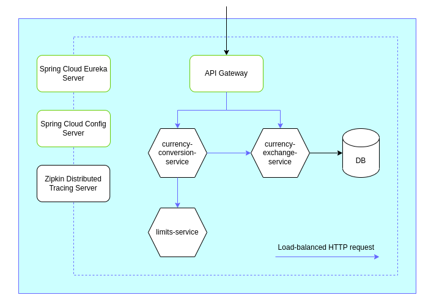

## Architecture

## How to run
1) Build docker images by executing `mvn spring-boot:build-image -DskipTests` for:
   - [api-gateway](api-gateway/)
   - [config-server](config-server/)
   - [naming-server](naming-server/)
   - [currency-conversion-service](currency-conversion-service/)
   - [currency-exchange-service](currency-exchange-service/)
   - [limits-service](limits-service/)
2) Start docker containers: `docker-compose up`

## Usage
- Eureka Naming Server - http://localhost:8762
- Config Server - http://localhost:8888
- Zipkin Tracing Server - http://localhost:9411
- RabbitMQ Management - http://localhost:15672
- Currency Conversion, Currency Exchange API - explore [postman collections](docs/postman-collections)

## API Reference
- swagger-ui for Currency Conversion API: `http://localhost:8765/currency-conversion/swagger-ui.html`
- json for Currency Conversion API: `http://localhost:8765/currency-conversion/v3/api-docs`
- swagger-ui for Currency Exchange API: `http://localhost:8080/currency-exchange/swagger-ui.html`
- json for Currency Exchange API: `http://localhost:8765/currency-exchange/v3/api-docs`